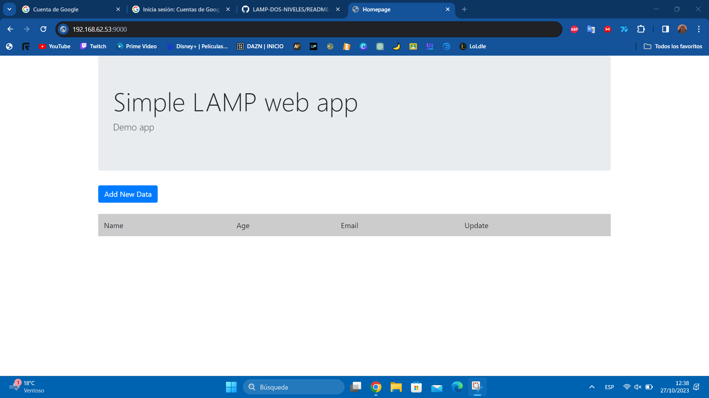

# # LAMP en dos niveles
### Creamos los sh de arpivisonamiento de las dos maquinas virtuales
#### Script para MySQL

#### Script para Apache2

### Una vez creados los scripts, configuraremos el Vagrantfile agregando ambas maquinas y aplicando el aprovisionamiento

### Una vez configurado todo, ponemos **vagrant up** y se empezaran a levantar ambas maquinas. Para comprobar que no han habido errores al iniciar las maquinas con el comando **vagrant status** podemos ver el estado de estas.

# Configuracion MySQL
### Lo primero que hay que hacer es entrar en el directorio */etc/mysql/mariadb.conf.d* y ahí modificar el fichero *50-server.cnf*.

### En este fichero cambiaremos la *bind-address* y pondremos la ip de nuestra maquina sql.

### Ahora entramos a mysql como root y creamos un usuario con la ip de la maquina apache y le daremos todos los permisos en la base de datos que deseemos.

### En el home de esta maquina clonaremos el repositorio de git para poder descargar la base de datos.

# Configuracion APACHE
### Creamos una carpeta en */var/www* y le cambiamos el propietario con **chown**. Despues clonamos el repositorio de github con **git clone** y el enlace del repositorio que queremos usar.

### Con sudo nano a el nuevo archivo de configuración ponemos la ruta de la carpeta en */var/www*.

### Ahora habilitamos el fichero de configuración con **a2ensite**. 

### Lo siguiente es entrar en la carpeta creada en */var/www* y editar el fichero config.php.

### En este fichero donde pone localhost ponemos la ip de la maquina de sql y cambiamos los datos de user y password.

### Ahora si ponemos la dirección de la maquina de apache en Google saldrá la pagina del LAMP.

